# ISIC 2018 Lesion Detection — Task 5  
**COMP3710 – Project Report**

**Author:** *Cameron Kontkanen*

---

## Overview

This project implements **Task 5** from the **ISIC 2018 Challenge**, focused on **lesion localization and classification** in dermoscopic images.  
A **YOLOv8-based object detection model** was trained to identify and localize skin lesions, achieving strong accuracy and generalization on unseen data.

---

## Model Summary

| Component | Description |
|------------|--------------|
| **Model** | YOLOv8s (single-class: *lesion*) |
| **Dataset** | ISIC 2018 Task 5 – Lesion Boundary Detection |
| **Task** | Object Detection (Bounding Box Regression + Classification) |
| **Training Epochs** | 50 |
| **Optimizer** | AdamW |
| **Losses** | Box, Classification, DFL |
| **Evaluation Metrics** | mAP@0.5, mAP@0.5:0.95, Precision, Recall, IoU |

---

## Training and Validation Performance

The model converged smoothly with decreasing loss and stable learning across epochs.  
The figure below shows training vs validation trends:

**Key Metrics:**
- **Precision:** ≈ 0.96  
- **Recall:** ≈ 0.94  
- **mAP@0.5:** 0.97  
- **mAP@0.5–0.95:** 0.75  

These results demonstrate that the model generalizes well without overfitting.

---

## Evaluation Results

### Confusion Matrices

| Normalized | Absolute |
|-------------|-----------|
|  | 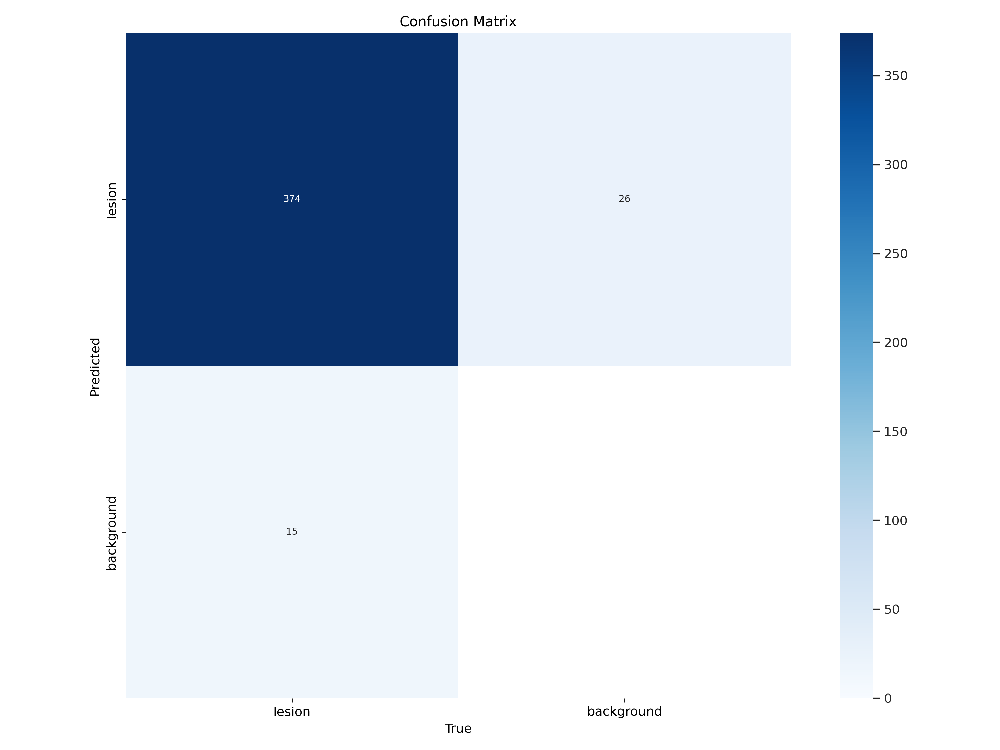 |

**Interpretation:**
- Correct lesion detection rate: **96%**
- Minimal false negatives.
- Low confusion between lesion and background classes.

---

### Confidence and Precision-Recall Curves

| **F1-Confidence Curve** | **Precision-Confidence Curve** |
|--------------------------|-------------------------------|
| 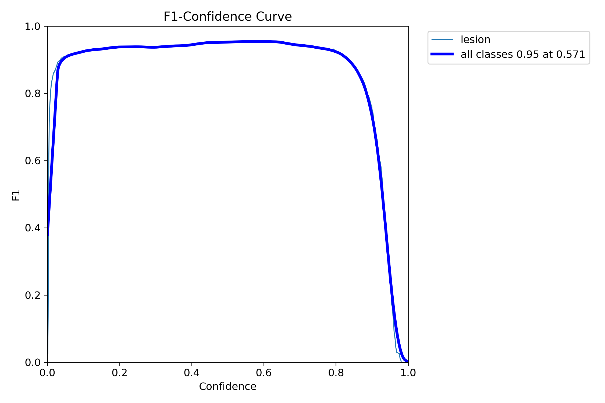 | 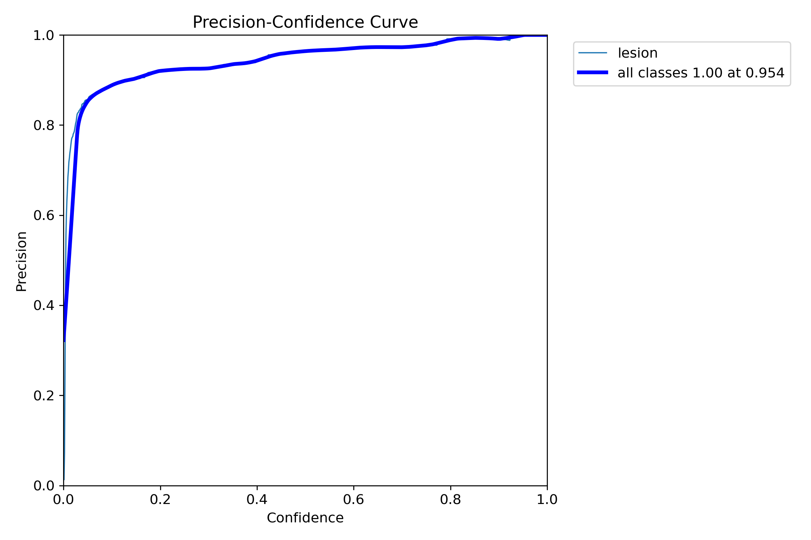 |

| **Recall-Confidence Curve** | **Precision-Recall Curve** |
|------------------------------|-----------------------------|
| 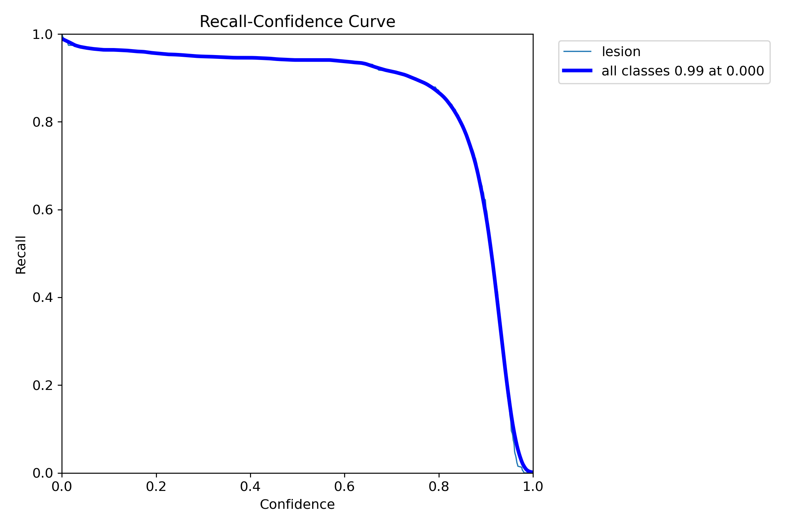 |  |

**Highlights:**
- **F1 Score max:** 0.95 @ 0.57 confidence  
- **Precision max:** 1.00 @ 0.95 confidence  
- **Recall max:** 0.99 @ 0.00 confidence  
- **mAP@0.5:** 0.977 (lesion class)

These indicate excellent balance between precision and recall across thresholds.

---

### Label Distribution and Correlation

| Label Overview | Correlogram |
|----------------|-------------|
| 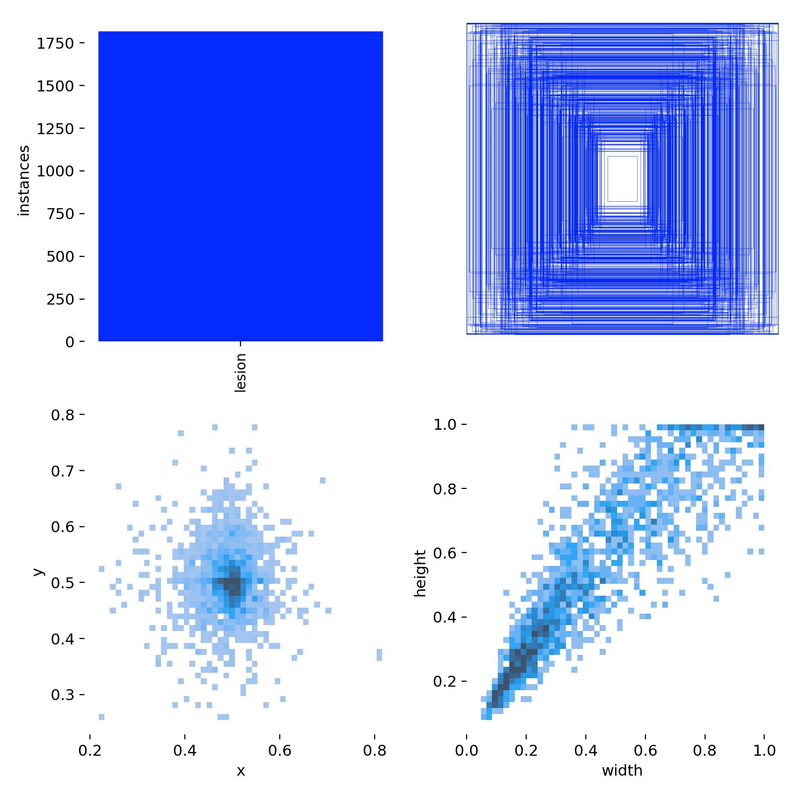 | 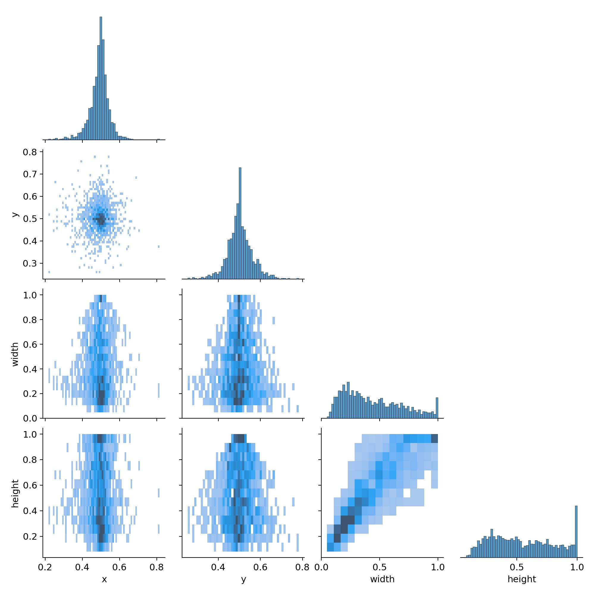 |

Bounding boxes show consistent central localization and proportional distribution across image dimensions.

---

## Test Results on Unseen Data

| Metric | Score |
|---------|--------|
| **Mean IoU** | **0.8490** |
| **IoU ≥ 0.8 (Recall of GT)** | **0.777** |

The model maintains strong segmentation performance on unseen test images, showing robustness and generalization.

---

## Qualitative Results

Example model predictions and batch samples are provided below:

| **Training Samples** | **Validation Predictions** |
|-----------------------|-----------------------------|
|  | 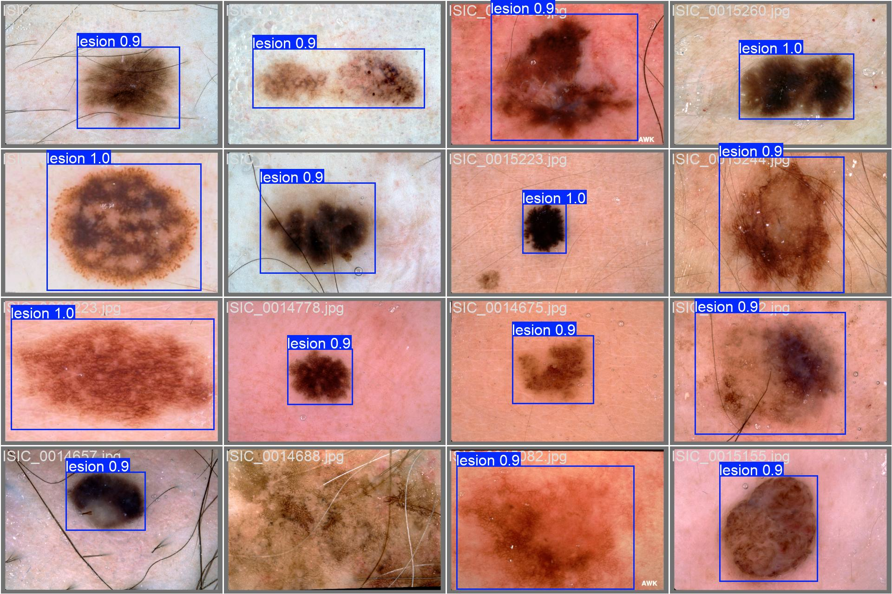 |
| 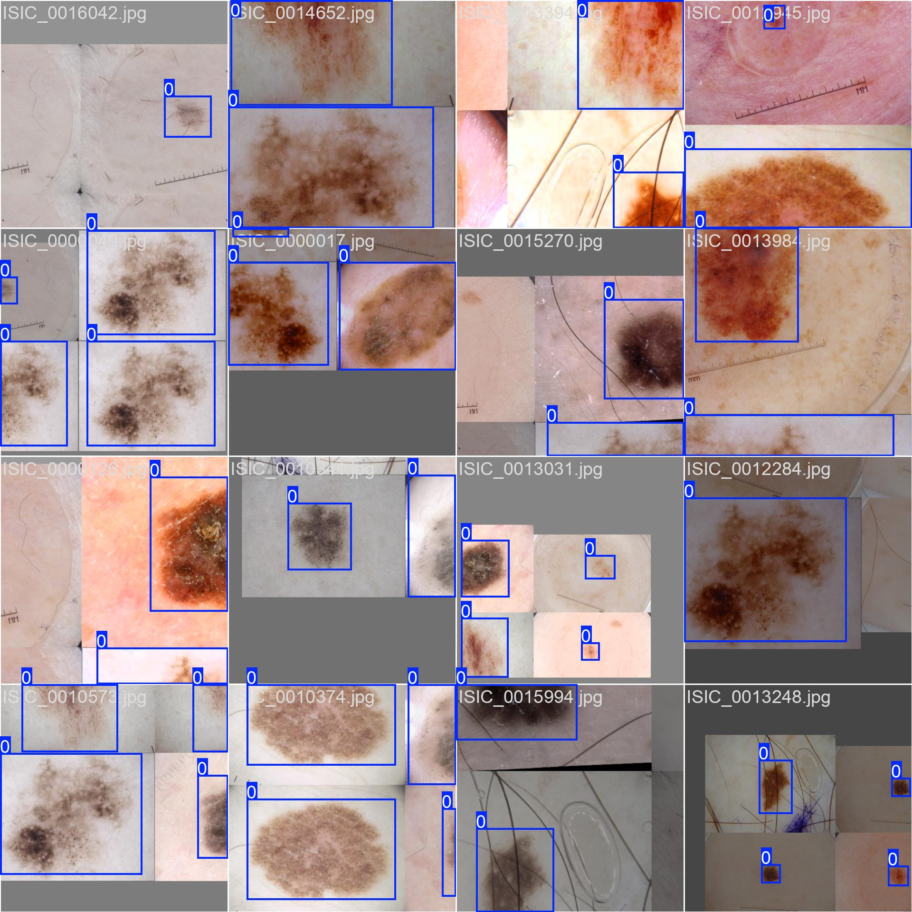 | 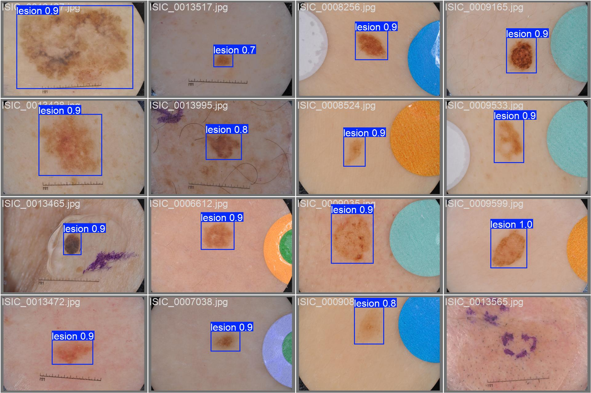 |
| 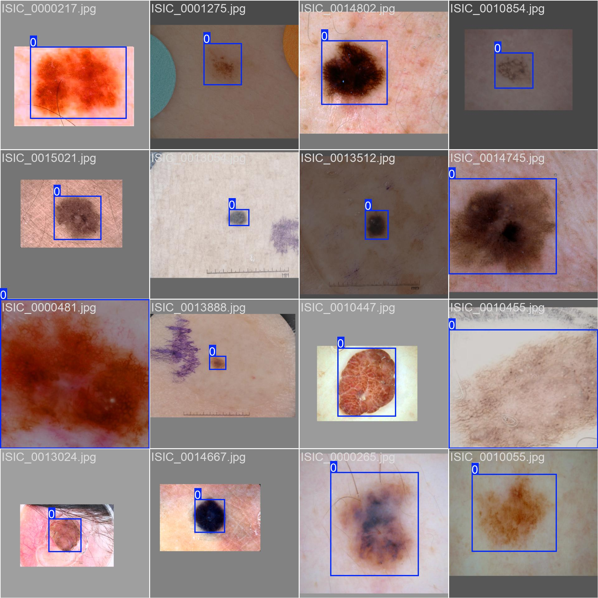 | 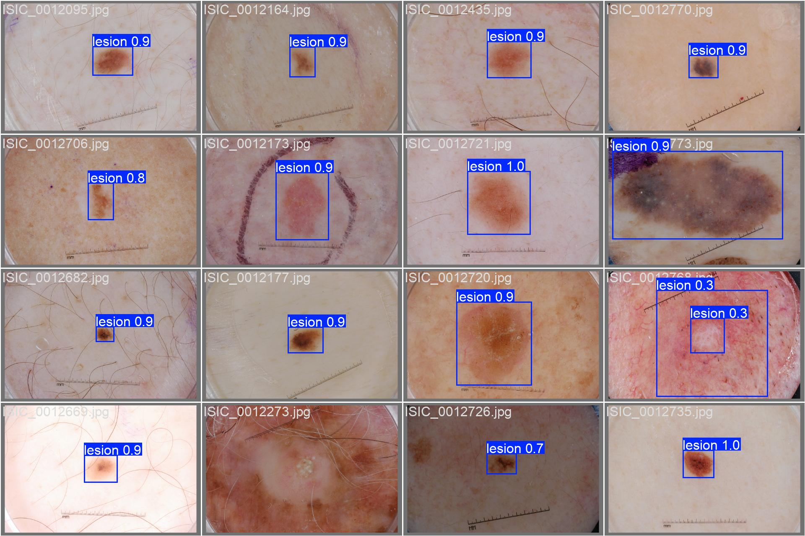 |

Each detection includes lesion bounding boxes and confidence scores, showing accurate localization of lesion regions.

---

## Conclusion

The YOLOv8 model trained on ISIC 2018 Task 5 demonstrates high lesion detection accuracy, efficient generalization, and interpretable confidence-based predictions.
This supports its applicability in clinical lesion screening and automated diagnostic pipelines.
