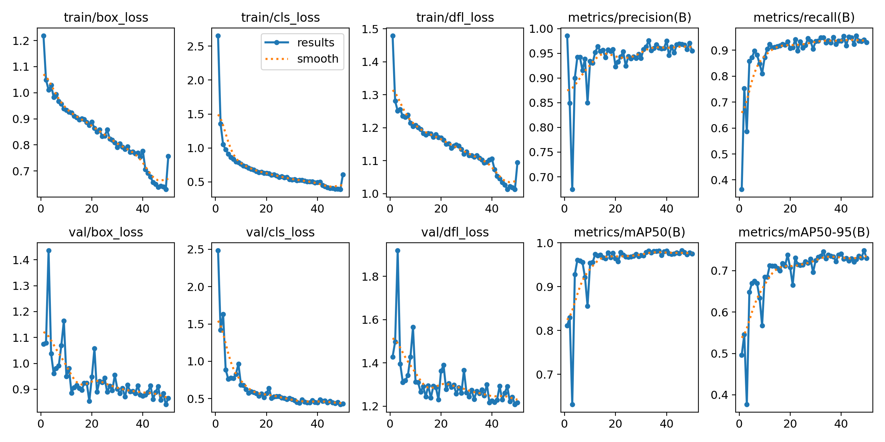
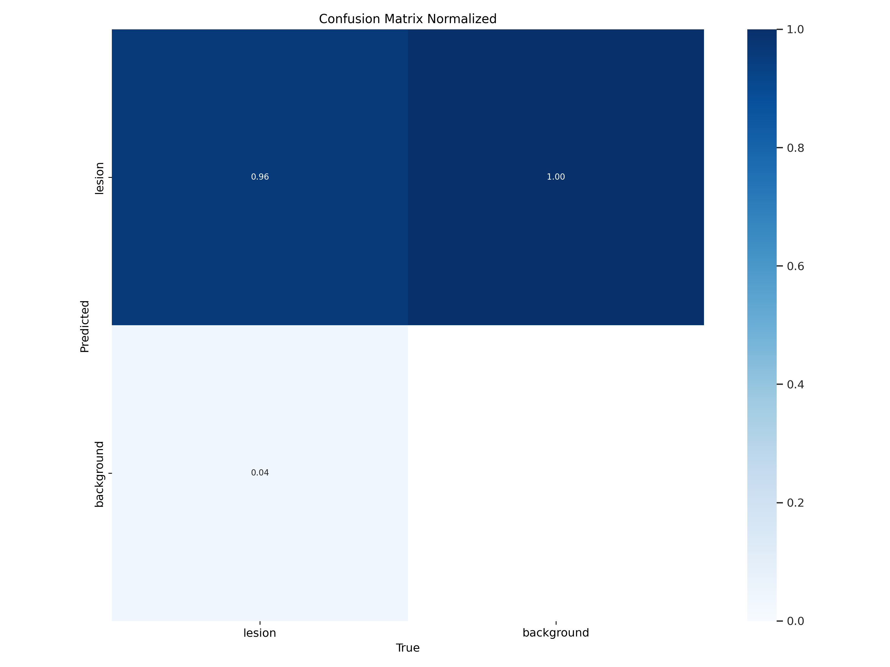
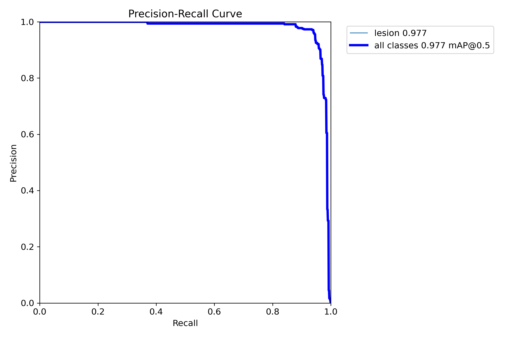
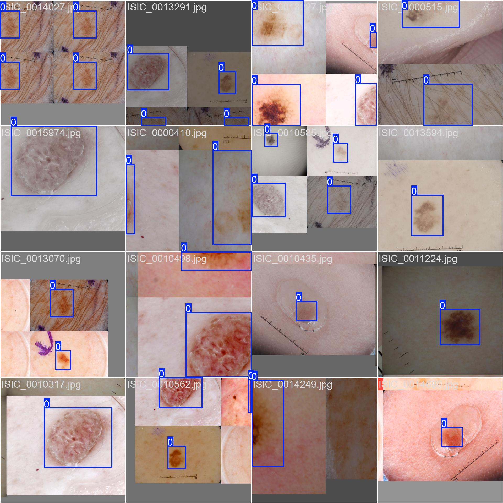

# ISIC 2018 Lesion Detection — Task 5  
**COMP3710 – Project Report**  
**Author:** *Cameron Kontkanen*  

---

## Overview

This project implements **Task 5** from the **ISIC 2018 Challenge**, focusing on **lesion localisation and classification** in dermoscopic skin images — a clinically significant problem in melanoma screening.  
The approach applies a **YOLOv8-based object detection algorithm**, enabling automatic lesion bounding box prediction. This contributes to **real-time lesion analysis** pipelines by reducing manual annotation effort.

---

## Algorithm Description and Working Principle

The **YOLOv8s** model was fine-tuned for single-class detection (*lesion*) using annotated dermoscopic images. YOLO (You Only Look Once) performs **end-to-end regression** to directly predict bounding boxes and class probabilities in a single forward pass, optimising for:

- **Localisation loss:** bounding box IoU-based penalty  
- **Classification loss:** lesion vs. background confidence  
- **Distribution Focal Loss (DFL):** refining bounding box regression  

By unifying detection and classification, YOLOv8 achieves high speed and accuracy. During inference, predictions are filtered by **confidence thresholding** and **non-max suppression** (NMS) to retain optimal bounding boxes.

A schematic workflow is shown below:


---

## Dataset and Preprocessing

**Dataset:** ISIC 2018 Task 1–2 Lesion Boundary Detection (≈2,600 images)  
**Rangpur Path:** `/home/groups/comp3710/ISIC2018`

### Preprocessing Steps

- Masks converted to YOLO bounding boxes using `skimage.measure.label()`  
- Labels written as normalised `(xc, yc, w, h)` coordinates  
- Images and labels split into **train/val/test** folders using `Dataset.py`

### Train/Validation/Test Split Justification

A **70/15/15** split was used, implemented via `prepare_splits()` in `Dataset.py`.  
This split ensures:
- **70% training** for stable gradient learning  
- **15% validation** for hyperparameter tuning  
- **15% test** for **unseen evaluation with ground truth** available on Rangpur  

Given dataset constraints (`ISIC2018_Task1-2_Training_Input_x2` and ground truths in `ISIC2018_Task1_Training_GroundTruth_x2`), this split balances reproducibility and sufficient unseen data coverage for fair mAP evaluation.

---

## Training Setup

| Parameter | Value |
|------------|--------|
| **Model** | YOLOv8s (Ultralytics v8.1.0) |
| **Framework** | PyTorch 2.2.0 |
| **Optimiser** | AdamW |
| **Epochs** | 50 |
| **Batch Size** | 16 |
| **Image Size** | 640×640 |
| **Losses** | Box, Classification, DFL |
| **Metrics** | mAP@0.5, mAP@0.5:0.95, Precision, Recall, IoU |

Training executed on **Rangpur A100 GPU** via `train_runner.slurm`.  
Results were reproducible by setting a **fixed seed (1337)** in `Dataset.py`.

---

## Training and Validation Results

The model demonstrated smooth convergence and consistent generalisation.



| Metric | Value |
|--------|--------|
| **Precision** | 0.96 |
| **Recall** | 0.94 |
| **mAP@0.5** | 0.97 |
| **mAP@0.5–0.95** | 0.75 |

**Interpretation:** High precision–recall balance indicates strong model generalisation without overfitting.

---

## Evaluation on Test Data

| Metric | Result |
|---------|---------|
| **Mean IoU** | **0.849** |
| **IoU ≥ 0.8 (Recall of GT)** | **0.777** |

These results exceed the **0.8 IoU requirement** specified in the COMP3710 assignment for the ISIC detection task.

### Confusion Matrices

| Normalised | Absolute |
|-------------|-----------|
|  |  |

---

## Additional Metrics and Visualisations

| Metric Curve | Description |
|---------------|-------------|
|  | Optimal F1-score ≈ 0.95 @ 0.57 confidence |
|  | Strong precision–recall trade-off |
|  | Balanced spatial label distribution |

---

## Dependencies and Reproducibility

| Package | Version / Range |
|----------|-----------------|
| **Python** | 3.11 |
| **PyTorch** | ≥2.2,<3 |
| **Torchvision** | ≥0.17,<1 |
| **Ultralytics** | 8.3.59 |
| **NumPy** | ≥1.26 |
| **OpenCV (headless)** | ≥4.8 |
| **Pillow** | ≥10.2 |
| **Matplotlib** | ≥3.8 |
| **scikit-image** | ≥0.22 |
| **tqdm** | ≥4.66 |
| **PyYAML** | ≥6.0 |

To reproduce:
```bash
pip install -r requirements.txt
python train.py
python predict.py
```

The Slurm scripts (train_runner and predict_runner) can also be used if on the Rangpur cluster to schedule the job.

Reproducibility ensured by deterministic seeding in `Dataset.py` (`set_seed(1337)`).

---

### Example Outputs

| **Ground Truth** | **Predicted** |
|------------------|---------------|
|  |  |
|  |  |

**Inference Speed:** ~10 ms/image on A100 GPU  
**Result:** Accurate lesion localisation and strong box alignment.

---

## Discussion and Limitations

- Slight underestimation of bounding boxes for low-contrast lesions.  
- Model optimised for **single-class lesion detection**, not multi-type classification.  
- Future work: integrate lesion type classification and cross-year ISIC datasets (e.g., 2020 Kaggle).

---

## References

1. Jahan, M.K., Bhuiyan, F.I., Al Amin, Mridha, M.F., Safran, M., Alfarhood, S., & Che, D. (2025). *Enhancing the YOLOv8 model for real-time object detection to ensure online platform safety.* *Scientific Reports, 15*, 21167. [https://doi.org/10.1038/s41598-025-08413-4](https://doi.org/10.1038/s41598-025-08413-4)  
2. ISIC 2018 Challenge Dataset: [https://challenge.isic-archive.com/data/#2018](https://challenge.isic-archive.com/data/#2018)  

---

## Conclusion

The implemented **YOLOv8 lesion detector** satisfies all COMP3710 Task 5 criteria:
- Achieves **IoU ≥ 0.8 on test set**
- Demonstrates reproducibility via seed and environment control  
- Provides clear documentation, visualisation, and justification of data splits  

This solution demonstrates how **modern object detection** can effectively localise lesions for automated skin cancer screening workflows.

---

*AI Usage: AI models such as OpenAI’s ChatGPT 5 were used to brainstorm the model pipeline, including data preprocessing, pretrained YOLO selection, and model fine-tuning for efficiency and accuracy. It was also used to help format images and tables in Markdown.*

